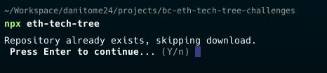

## Installation

* Confusing text: `Press Enter to continue` and asking for `Y/n`

## Challenge 1

1.  Never asked for define a `votesFor` and `votesAgainst` storage variable until you pass the test. There you'll get an error from tests, missing this storage variable.
Maybe would be nice to tell somewhere to create Two variables called: `votesFor` and `votesAgainst` to not fail test and redo some code (in case you used other data structure to store votes).

